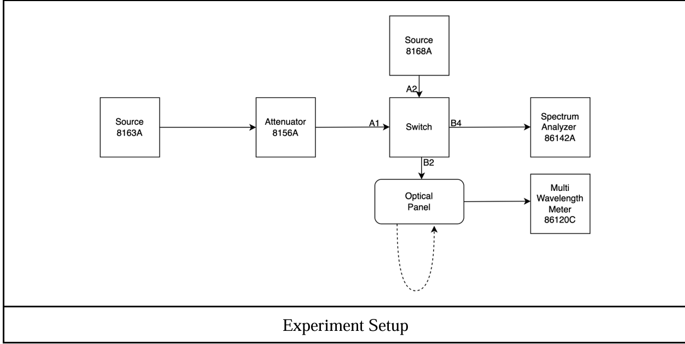
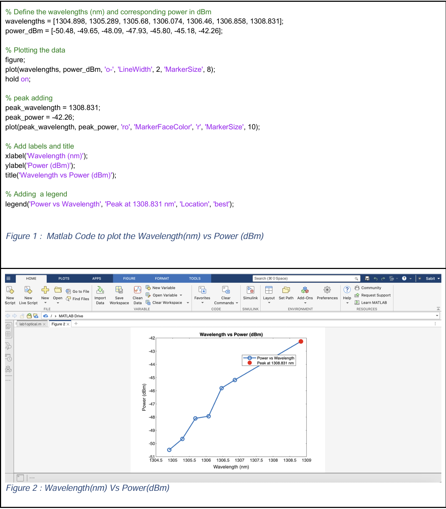
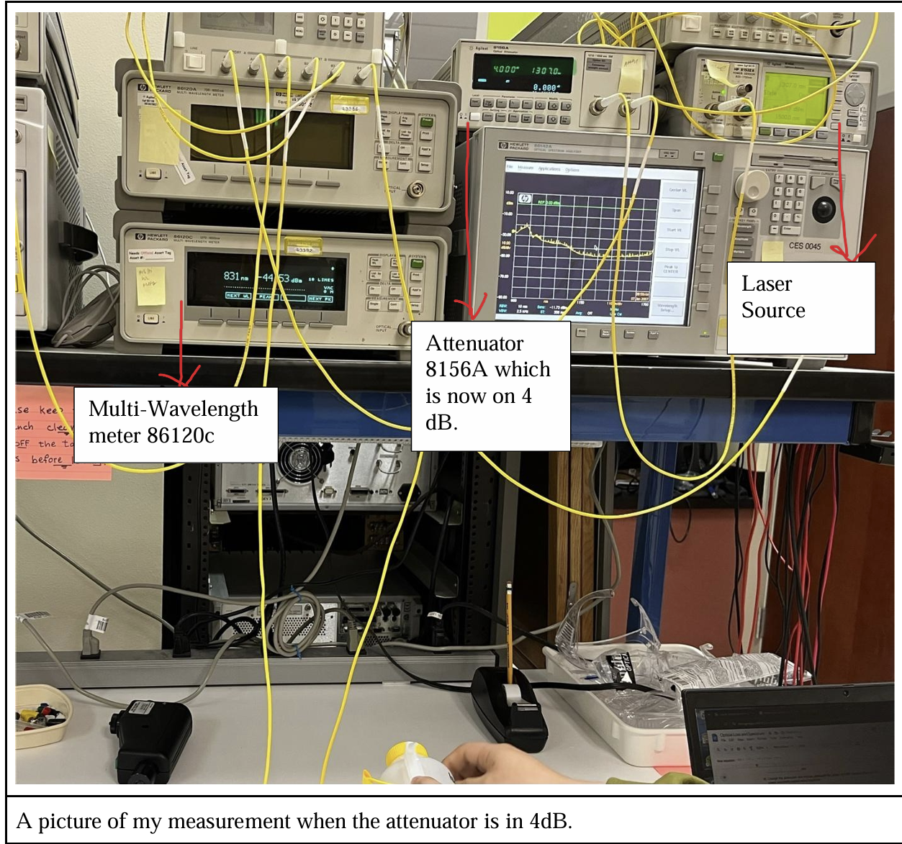
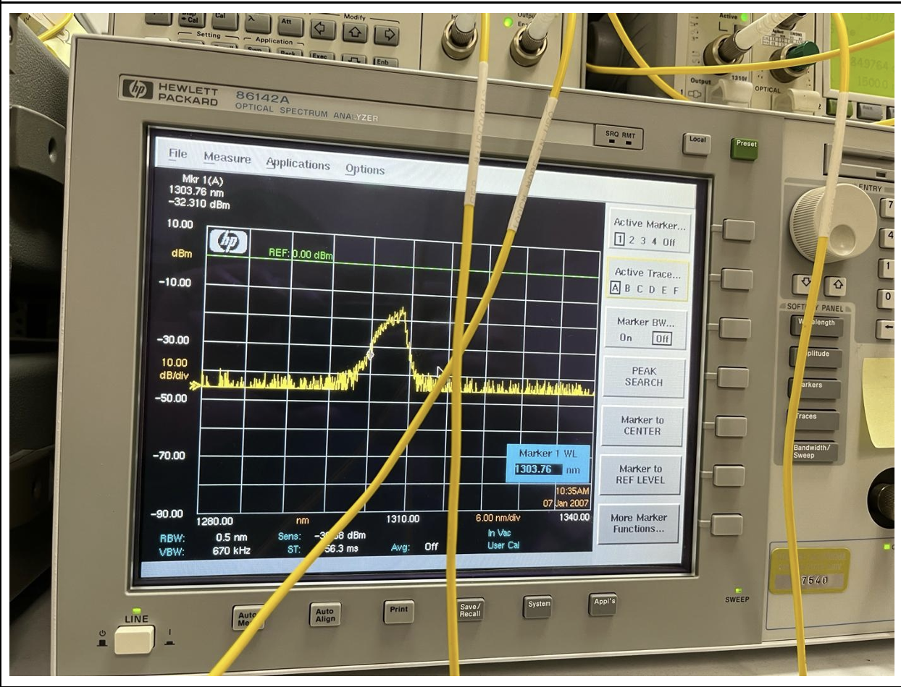

# fiber-optic-loss-spectrum-analysis
Fiber optic experiment analyzing optical loss, attenuation, wavelength spectrum, and bandwidth using lab equipment and MATLAB.

# Fiber Optic Loss & Spectrum Analysis

## Overview

This project focuses on analyzing optical signal behavior in a fiber optic communication system, including wavelength spectrum, attenuation, and power loss under different conditions.

The experiment involved measuring optical power, evaluating losses due to splicing and bending, and analyzing spectral characteristics using laboratory equipment and MATLAB.

## Objective

* Measure optical power and wavelength
* Analyze fiber loss due to attenuation, splicing, and bending
* Calculate spectral bandwidth (-3 dB and -20 dB)
* Visualize wavelength vs power using MATLAB

## System Setup

The experiment used a fiber optic test setup consisting of:

* Laser Source (8163A)
* Optical Attenuator (8156A)
* Optical Switch
* Multi-Wavelength Meter (86120C)
* Spectrum Analyzer
* Fiber loop and spliced fiber

## Key Experiments

### 1. Wavelength and Power Measurement

* Input wavelength set to ~1307 nm
* Measured peak wavelength ≈ 1308.831 nm
* Observed variation due to noise, reflections, and connector losses

### 2. Average Power Calculation

* Collected multiple wavelength-power measurements
* Calculated average power ≈ 29.01 nW

### 3. Attenuation Analysis

* Applied 2 dB and 4 dB attenuation
* Verified output power decreased proportionally with attenuation

### 4. Fiber Splice Loss

* Compared power before and after splice
* Calculated splice loss ≈ 0.48 dB

### 5. Bending Loss (Extrinsic Loss)

* Bent fiber using cylindrical fixture (~7.5 cm diameter)
* Observed reduction in power without wavelength shift
* Identified as extrinsic loss due to physical deformation

### 6. Spectral Analysis

* Measured wavelength range using spectrum analyzer
* Calculated:

  * 3 dB bandwidth ≈ 2.04 nm
  * 20 dB bandwidth ≈ 6.12 nm

## MATLAB Visualization

Used MATLAB to plot wavelength vs power:

* Input: wavelength (nm)
* Output: power (dBm)
* Highlighted peak wavelength

## Skills Demonstrated

* Fiber optic system analysis
* Optical measurement techniques
* Signal attenuation analysis
* Spectral analysis
* MATLAB data visualization
* Experimental data interpretation

## Tools & Technologies

* Optical lab equipment (Laser Source, Attenuator, Spectrum Analyzer)
* MATLAB
* Fiber optic measurement systems

## System Visualization

### Experimental Setup

### MATLAB Plot

### Lab Measurement

## Code

- [MATLAB Plot Script](code/matlab_plot.m)

###Spectral Analyzer

